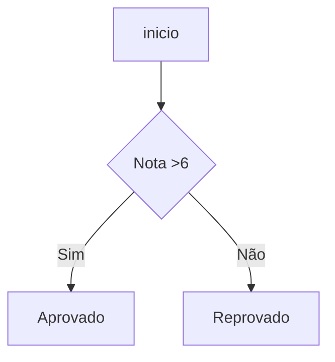
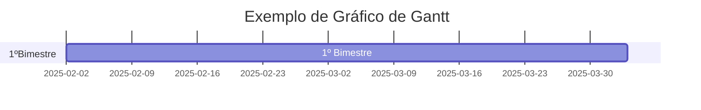

```mermaid
flowchart TD
    A([Inicio])
    A --> B{"Faça um Escolha"}
    B --> C["OP1"]
    B --> D["OP2"]
    B --> E["OP3"]
```

```mermaid
graph TD;
  A[inicio] --> B{Nota >6};
  B -->|Sim| C[Aprovado];
 B --> |Não| D[Reprovado];

```

```mermaid
gantt
   title Exemplo de Gráfico de Gantt
   dateFormat YYYY-MM-DD 
   section 1ºBimestre
   1º Bimestre :a1, 2025-02-02, 60d
   section 2º Bimestre
```
