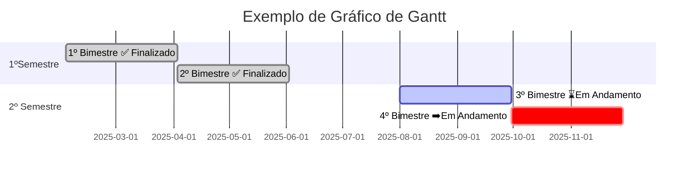

```mermaid
gantt
   title Exemplo de Gráfico de Gantt
   dateFormat YYYY-MM-DD 
   section 1ºSemestre
   1º Bimestre ✅ Finalizado:done, a1, 2025-02-02, 60d
   2º Bimestre ✅ Finalizado:done, a2, after a1, 60d
   section 2º Semestre
   3º Bimestre ⌛Em Andamento:active, a3, 2025-08-01, 60d
   4º Bimestre ➡️Em Andamento:crit, a4, after a3,60d 
```
